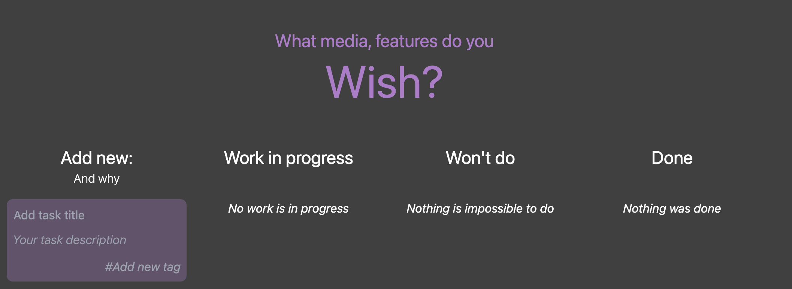

# Homelab Wishlist

## Description

Your home lab is never complete. If you want your users to be happy, let them suggest new features and report bugs to you. You can store your ideas here too.

Do whatever, it's your todos ;)

## Installation

Application let's you generate QR code for your wifi network. You can print it and put it on the wall. Then your guests can scan it and connect to your wifi network.



```bash
git clone https://github.com/gkk-dev-ops/wishlist.git
```

Adjust PORT and DOMAIN_NAME of your server in docker compose `app.build.args` and `ALLOWED_ORIGINS`.
